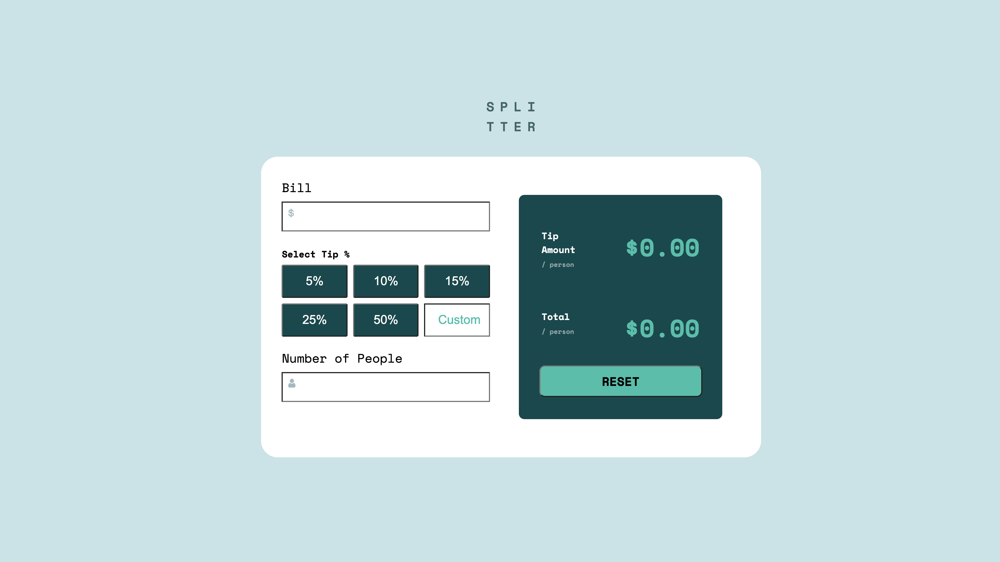

# Frontend Mentor - Tip calculator app solution

This is a solution to the [Tip calculator app challenge on Frontend Mentor](https://www.frontendmentor.io/challenges/tip-calculator-app-ugJNGbJUX). Frontend Mentor challenges help you improve your coding skills by building realistic projects.

## Table of contents

- [Overview](#overview)
  - [The challenge](#the-challenge)
  - [Screenshot](#screenshot)
  - [Links](#links)
- [My process](#my-process)
  - [Built with](#built-with)
  - [What I learned](#what-i-learned)
- [Author](#author)


## Overview

### The challenge

Users should be able to:

- View the optimal layout for the app depending on their device's screen size
- See hover states for all interactive elements on the page
- Calculate the correct tip and total cost of the bill per person




### Links

- Solution URL: [https://www.frontendmentor.io/solutions/tip-calculator-javascript-h2SqL7XuF](https://www.frontendmentor.io/solutions/tip-calculator-javascript-h2SqL7XuF)
- Live Site URL: [https://vibrant-carson-1d0570.netlify.app/](https://vibrant-carson-1d0570.netlify.app/)

## My process

### Built with

- Semantic HTML5 markup
- CSS custom properties
- Flexbox
- CSS Grid
- Mobile-first workflow
- Javascript


### What I learned

- The innerHTML property sets or returns the HTML content (inner HTML) of an element.
- The parseFloat() method parses a value as a string and returns the first number.
- The textContent property sets or returns the text content of the specified node, and all its descendants.
- The addEventListener() method attaches an event handler to the specified element.
- The toFixed() method converts a number to a string.
- The toFixed() method rounds the string to a specified number of decimals.
- The equality operator (==) checks whether its two operands are equal, returning a Boolean result. Unlike the strict equality operator, it attempts to convert and compare operands that are of different types.


```css
  background-image: url("images/icon-dollar.svg");
  background-color: white;
  background-position: 10px 10px;
  background-repeat: no-repeat;

  Css code to display icon inside the input 
```


```js
function cantBeZero() {
  const numOfPeople = document.querySelector(".number-of-people").value;
  if (numOfPeople == "0") {
    document.getElementById("error").textContent = "can`t be zero";
    iniTialize(tipAmount);
    document.getElementById("total-amount").textContent = "$0.00";
  }
}

if statement to be executed if the user enter 0 as number of people to be split the bill, it will display an error message that can't be zero.

```

## Author

- Website - [scriptsandtags.com](https://www.scriptsandtags.com/)
- Frontend Mentor - [@whoiskekeanyway](https://www.frontendmentor.io/profile/whoiskekeanyway)
- Twitter - [@scriptsandtags](https://www.twitter.com/scriptsandtags)

